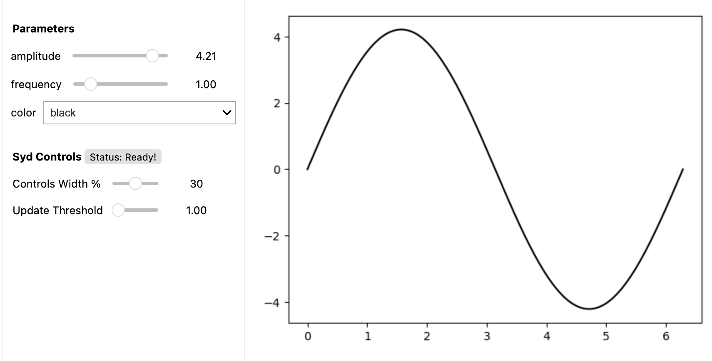

Quick Start Guide
=================

This page will show you the basics of how to make an interactive plot with SYD. It's a
pretty simple example, but it's a good starting point. We'll make a simple sine wave
plot where we can control the frequency, amplitude, and color of the wave. 

Creating Your First Interactive Plot
------------------------------------

1. **Create a viewer class.**

This returns a viewer object that you can use to add interactive components to your
plot and then deploy it. 

.. code-block:: python
    
    from syd import make_viewer
    import matplotlib.pyplot as plt
    import numpy as np

    viewer = make_viewer()

2. **Add a plotting method to the viewer.**

This method will be called whenever the viewer is deployed or when a parameter is
changed. Some notes: 

- All plot methods have to take a single argument: ``state``. ``State`` is a 
  dictionary that contains the current values of all the parameters in the viewer. 

- The plot method should create and return a matplotlib figure. SYD will handle what to
  do with it - you just need to create it. Don't call ``plt.show()``!

.. code-block:: python

    def plot(state):
        """Plot the waveform based on current parameters."""
        t = np.linspace(0, 2*np.pi, 1000)
        y = np.sin(state["frequency"] * t) * state["amplitude"]
        fig = plt.figure()
        ax = plt.gca()
        ax.plot(t, y, color=state["color"])
        return fig

    viewer.set_plot(plot)

    # Note: you can also add the plot when you make the viewer with:
    # viewer = make_viewer(plot=plot)

3. **Add parameters to control your plot.**

These parameters will be converted into interactive components that you can control
manually to change the plot. SYD will automatically use the right component depending
on the type of parameter you pass in. In this example, we're using two float sliders
and a dropdown menu. 

- Each parameter requires a name (here it's ``'frequency'``, ``'amplitude'``, and ``'color'``).
- The ``value`` argument is the initial value of the parameter -- it's required.
- Each parameter type might have it's own additional arguments, most of them are required.

.. code-block:: python

    viewer.add_float("frequency", value=1.0, min_value=0.1, max_value=5.0)
    viewer.add_float("amplitude", value=1.0, min_value=0.1, max_value=2.0)
    viewer.add_selection("color", value="red", options=["red", "blue", "green"])

4. **Deploy the viewer!**

Right now, the only way to deploy the viewer is within a jupyter notebook (or colab).
Soon we'll provide support for standalone applications and deployment to a web browser
that you can share from within your local network. Bug us on github if you want this 
sooner!

.. code-block:: python

    viewer.deploy()

You can check out the above example in a notebook `here <https://github.com/landoskape/syd/blob/main/examples/1-simple_example.ipynb>`_ 
or run it yourself in colab:

.. image:: https://colab.research.google.com/assets/colab-badge.svg
   :target: https://colab.research.google.com/github/landoskape/syd/blob/main/examples/1-simple_example.ipynb
   :alt: Open In Colab

Learn More About How to Use SYD
--------------------------------
There's a lot more you can do with SYD. To learn more, check out the following sections:

:doc:`components`

Learn about the different types of parameters you can use to create your interactive plots.

:doc:`tutorial`

Learn how to create more complex interactive plots with SYD.

:doc:`api/index`

Learn about the SYD API and how to use it to create your own custom components.