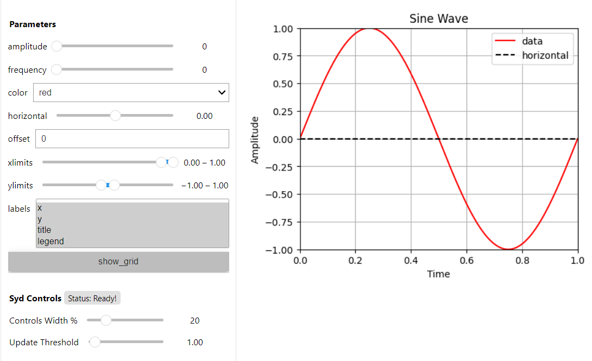

.. _tutorial:

Tutorial
========

This tutorial contains a complete example that shows you how to use all the features of Syd. It will show
you how to: 

* Make a viewer with the factory method (:func:`~syd.viewer.make_viewer`) or by creating a subclass of :class:`~syd.viewer.Viewer`.
* Add all the different types of parameters. 
* Make hierarchical and inter-related callbacks. 
* Get your data into the viewer.

0. Define a dataset for plotting.
^^^^^^^^^^^^^^^^^^^^^^^^^^^^^^^^^

Syd is designed to make it easy to explore data. For this tutorial, we'll create a simple "dataset" that will show how you can
reference data in your viewer. Since it's a tutorial, it'll be a bit contrived, but it'll show you the principle of how to access
data in a Syd viewer. 

.. code-block:: python

    import numpy as np

    # Create a simple dataset
    T = 1000
    amplitudes = list(np.linspace(1.0, 5.0, 100))
    frequencies = list(np.linspace(1.0, 20.0, 100))
    num_amplitudes = len(amplitudes)
    num_frequencies = len(frequencies)
    
    # Create a time array and an empty numpy array to store the data
    t = np.linspace(0, 1, T)
    data = np.zeros((num_amplitudes, num_frequencies, T))

    # Fill the data array with the sine wave data
    for i, amplitude in enumerate(amplitudes):
        for j, frequency in enumerate(frequencies):
            data[i, j, :] = np.sin(frequency * t * 2 * np.pi) * amplitude

    # Create a dataset dictionary
    dataset = {
        "amplitudes": amplitudes,
        "frequencies": frequencies,
        "t": t,
        "data": data,
    }

    # Now, we have a simple dataset to use. Let's pretend that it's a complicated and large dataset
    # that you've stored on disk. You'll probably have a nice function that loads the data. 
    def load_data(amplitude, frequency):
        """Load the data for a given amplitude and frequency."""
        iamplitude = dataset["amplitudes"].index(amplitude)
        ifrequency = dataset["frequencies"].index(frequency)
        return dataset["t"], dataset["data"][iamplitude, ifrequency]

1. Create a viewer object.
^^^^^^^^^^^^^^^^^^^^^^^^^^

As in the quickstart section, you will always start by making a viewer object. There are two ways to do this:

1. Factory-based Viewer (simple and flexible)
Use the :func:`~syd.viewer.make_viewer` function to instantiate an empty viewer object, then customize it by adding components programmatically.

2. Subclass-based Viewer (for advanced customization)
Subclass the :class:`~syd.viewer.Viewer` base class to create an integrated viewer object for your specific use case. This approach is recommended when you need to encapsulate complex viewer behavior or reuse the same configuration across different contexts.

.. tabs::
  
  .. tab:: Factory-based

    .. code-block:: python

        # Start by importing the make_viewer function
        from syd import make_viewer

        # Then use it to make an empty viewer object!
        viewer = make_viewer()

  .. tab:: Subclass-based

    .. code-block:: python

        # Start by importing the Viewer class
        from syd import Viewer

        # Then create a subclass of Viewer
        class MyViewer(Viewer):
            pass
            # We'll expand on this later...

        # Then initialize the viewer with your custom class
        viewer = MyViewer()

2. Add components to the viewer that will interactively control your plot.
^^^^^^^^^^^^^^^^^^^^^^^^^^^^^^^^^^^^^^^^^^^^^^^^^^^^^^^^^^^^^^^^^^^^^^^^^^

Each component of Syd is associated with an "add_method" that should be used when you are building
a new viewer. (For a reference to all the components, see :doc:`components`.) When you create a new
viewer, you should consider what parameters you need to control your plot, and then add the appropriate
components to the viewer.

For example, in the dataset above, we have two parameters that we can control: the amplitude and the frequency.
The dataset is composed of specific amplitudes and frequencies, so we can use an integer index to select which
amplitude and frequency we want to plot.

.. tabs::

  .. tab:: Factory-based

    .. code-block:: python

        from syd import make_viewer

        num_amplitudes = len(dataset["amplitudes"])
        num_frequencies = len(dataset["frequencies"])
        
        # When you don't specify a value for an integer, 
        # it will be initialized to the minimum value (0). 
        viewer = make_viewer()
        viewer.add_integer("amplitude", min=0, max=num_amplitudes-1)
        viewer.add_integer("frequency", min=0, max=num_frequencies-1)

  .. tab:: Subclass-based

    .. code-block:: python

        from syd import Viewer

        num_amplitudes = len(dataset["amplitudes"])
        num_frequencies = len(dataset["frequencies"])

        class MyViewer(Viewer):
            def __init__(self):
                # When you don't specify a value for an integer, 
                # it will be initialized to the minimum value (0). 
                self.add_integer("amplitude", min=0, max=num_amplitudes-1)
                self.add_integer("frequency", min=0, max=num_frequencies-1)

Now, let's say we also want to control a few other things about the plot:

* The color of the plot (we'll use a dropdown menu of color strings).
* A horizontal line indicating a particular value (we'll use a float slider).
* The offset of the plot (we'll use an unbounded float).
* The xlimits of the plot (we'll use a float range slider).
* The ylimits of the plot (we'll use a float range slider).
* Which labels to show (we'll use a multi-select menu).
* Whether or not to show a grid (we'll use a boolean checkbox).

.. tabs::

  .. tab:: Factory-based

    .. code-block:: python
        
        from syd import make_viewer

        num_amplitudes = len(dataset["amplitudes"])
        num_frequencies = len(dataset["frequencies"]) 
        
        viewer = make_viewer()
        viewer.add_integer("amplitude", min=0, max=num_amplitudes-1)
        viewer.add_integer("frequency", min=0, max=num_frequencies-1)

        # Add all the other components we want to control
        viewer.add_selection("color", value="red", options=["red", "blue", "green"])
        viewer.add_float("horizontal", value=0.0, min=-10.0, max=10.0)
        viewer.add_unbounded_float("offset", value=0.0)
        viewer.add_float_range("xlimits", value=(0.0, 1.0), min=-10.0, max=1.0)
        viewer.add_float_range("ylimits", value=(-1.0, 1.0), min=-10, max=10)
        viewer.add_multiple_selection("labels", value=["x", "y", "title", "legend"], options=["x", "y", "title", "legend"])
        viewer.add_boolean("show_grid", value=True)

  .. tab:: Subclass-based

    .. code-block:: python

        from syd import Viewer

        num_amplitudes = len(dataset["amplitudes"])
        num_frequencies = len(dataset["frequencies"])

        class MyViewer(Viewer):
            def __init__(self):
                self.add_integer("amplitude", min=0, max=num_amplitudes-1)
                self.add_integer("frequency", min=0, max=num_frequencies-1)

                # Add all the other components we want to control
                self.add_selection("color", value="red", options=["red", "blue", "green"])
                self.add_float("horizontal", value=0.0, min=-10.0, max=10.0)
                self.add_unbounded_float("offset", value=0.0)
                self.add_float_range("xlimits", value=(0.0, 1.0), min=-10.0, max=1.0)
                self.add_float_range("ylimits", value=(-1.0, 1.0), min=-10, max=10)
                self.add_multiple_selection("labels", value=["title", "legend"], options=["x", "y", "title", "legend"])
                self.add_boolean("show_grid", value=True)

3. The state of the viewer
^^^^^^^^^^^^^^^^^^^^^^^^^^

The state of the viewer is a dictionary that contains the current values of all the parameters in the viewer.
You can access it by calling ``viewer.state`` (or ``self.state`` if you are using the subclass-based viewer).

The state is automatically updated whenever a parameter changes, and so reflects the current state of your GUI.
Parameters (e.g. components) are always associated with a particular value, even at initialization. So, if you
were to retrieve the state of the viewer right now, it would look like this:

.. tabs::

  .. tab:: Factory-based

    .. code-block:: python

        from syd import make_viewer

        num_amplitudes = len(dataset["amplitudes"])
        num_frequencies = len(dataset["frequencies"]) 
        
        viewer = make_viewer()
        viewer.add_integer("amplitude", min=0, max=num_amplitudes-1)
        viewer.add_integer("frequency", min=0, max=num_frequencies-1)
        viewer.add_selection("color", value="red", options=["red", "blue", "green"])
        viewer.add_float("horizontal", value=0.0, min=-10.0, max=10.0)
        viewer.add_unbounded_float("offset", value=0.0)
        viewer.add_float_range("xlimits", value=(0.0, 1.0), min=-10.0, max=1.0)
        viewer.add_float_range("ylimits", value=(-1.0, 1.0), min=-10, max=10)
        viewer.add_multiple_selection("labels", value=["x", "y", "title", "legend"], options=["x", "y", "title", "legend"])
        viewer.add_boolean("show_grid", value=True)

        # You can access the current state of the viewer by calling viewer.state
        print(viewer.state)
        {
            "amplitude": 0,
            "frequency": 0,
            "color": "red",
            "horizontal": 0.0,
            "offset": 0.0,
            "xlimits": (0.0, 1.0),
            "ylimits": (-1.0, 1.0),
            "labels": ["title", "legend"],
            "show_grid": True,
        }

  .. tab:: Subclass-based

    .. code-block:: python
        
        from syd import Viewer

        num_amplitudes = len(dataset["amplitudes"])
        num_frequencies = len(dataset["frequencies"])

        class MyViewer(Viewer):
            def __init__(self):
                self.add_integer("amplitude", min=0, max=num_amplitudes-1)
                self.add_integer("frequency", min=0, max=num_frequencies-1)
                self.add_selection("color", value="red", options=["red", "blue", "green"])
                self.add_float("horizontal", value=0.0, min=-10.0, max=10.0)
                self.add_unbounded_float("offset", value=0.0)
                self.add_float_range("xlimits", value=(0.0, 1.0), min=-10.0, max=1.0)
                self.add_float_range("ylimits", value=(-1.0, 1.0), min=-10, max=10)
                self.add_multiple_selection("labels", value=["title", "legend"], options=["x", "y", "title", "legend"])
                self.add_boolean("show_grid", value=True)

                # self.state will enable you to access the state of the viewer
                print(self.state)

        viewer = MyViewer()
        
        # So will viewer.state once you've initialized it to a particular name! (In this case, "viewer")
        print(viewer.state)
        {
            "amplitude": 0,
            "frequency": 0,
            "color": "red",
            "horizontal": 0.0,
            "offset": 0.0,
            "xlimits": (0.0, 1.0),
            "ylimits": (-1.0, 1.0),
            "labels": ["title", "legend"],
            "show_grid": True,
        }

4. Add a plot method to the viewer.
^^^^^^^^^^^^^^^^^^^^^^^^^^^^^^^^^^^

The plot method is the most important method in a viewer. It is called whenever the viewer's state changes,
and it is where you update the plot based on the current state.

There are some key rules about the plot method:

.. important::

    * Plot methods should accept a single argument, which is the current state of the viewer.
        
        .. code-block:: python

            # For factory-based viewers, the signature should look like this:
            def plot(state):

            # For subclass-based viewers, the signature should look like this:
            class YourViewer(Viewer):
                def plot(self, state):

    * Plot methods should create and return a matplotlib figure.

        .. code-block:: python

            def plot(state):
                # Make a new figure in your plot function
                fig = plt.figure()
                # ... do some stuff to make your plot ...

                # Then return the figure object!!!!
                return fig

    * Plot methods should not call ``plt.show()``!
        Syd will handle displaying the figure for you. Calling ``plt.show()`` will cause your plot to be displayed twice
        and other unexpected behavior. 

Let's make our plot method! 

.. tabs::

  .. tab:: Factory-based

    .. code-block:: python

        from syd import make_viewer

        viewer = make_viewer()

        # ... all the add_* methods ...

        def plot(state):
            # Get the data based on the current state
            current_amplitude = dataset["amplitudes"][state["amplitude"]]
            current_frequency = dataset["frequencies"][state["frequency"]]
            time, data = load_data(current_amplitude, current_frequency)

            # Get all the other parameters for plotting
            color = state["color"]
            horizontal = state["horizontal"]
            offset = state["offset"]
            xlimits = state["xlimits"]
            ylimits = state["ylimits"]
            labels = state["labels"]
            show_grid = state["show_grid"]

            # Make your figure
            fig, ax = plt.subplots(1, 1, figsize=(5, 4), layout="constrained")
            ax.plot(time, data + offset, color=color, label="data")
            ax.axhline(horizontal, color="black", linestyle="--", label="horizontal")
            ax.set_xlim(xlimits)
            ax.set_ylim(ylimits)
            if "x" in labels:
                ax.set_xlabel("Time")
            if "y" in labels:
                ax.set_ylabel("Amplitude")
            if "title" in labels:
                ax.set_title("Sine Wave")
            if "legend" in labels:
                ax.legend(loc="best")
            if show_grid:
                ax.grid()

            # Return the figure
            # ~ WITHOUT CALLING plt.show()!!! ~
            return fig

        # Tell the viewer to use your plot method
        viewer.set_plot(plot)

        # Note: if the plot method existed already, you could have done this:
        # viewer = make_viewer(plot)

  .. tab:: Subclass-based

    .. code-block:: python

        from syd import Viewer

        class MyViewer(Viewer):
            def __init__(self):
                # ... all the add_* methods ...
                
            def plot(self, state):
                # Get the data based on the current state
                current_amplitude = dataset["amplitudes"][state["amplitude"]]
                current_frequency = dataset["frequencies"][state["frequency"]]
                time, data = load_data(current_amplitude, current_frequency)

                # Get all the other parameters for plotting
                color = state["color"]
                horizontal = state["horizontal"]
                offset = state["offset"]
                xlimits = state["xlimits"]
                ylimits = state["ylimits"]
                labels = state["labels"]
                show_grid = state["show_grid"]

                # Make your figure
                fig, ax = plt.subplots(1, 1, figsize=(5, 4), layout="constrained")
                ax.plot(time, data + offset, color=color, label="data")
                ax.axhline(horizontal, color="black", linestyle="--", label="horizontal")
                ax.set_xlim(xlimits)
                ax.set_ylim(ylimits)
                if "x" in labels:
                    ax.set_xlabel("Time")
                if "y" in labels:
                    ax.set_ylabel("Amplitude")
                if "title" in labels:
                    ax.set_title("Sine Wave")
                if "legend" in labels:
                    ax.legend(loc="best")
                if show_grid:
                    ax.grid()

                # Return the figure
                # ~ WITHOUT CALLING plt.show()!!! ~
                return fig

        # The plot method is a bound method to the MyViewer subclass, so this 
        # part doesn't need to be changed at all!
        viewer = MyViewer()

5. Adding callbacks to the viewer.
^^^^^^^^^^^^^^^^^^^^^^^^^^^^^^^^^^

A callback is a function that is called in response to some event. Syd enables you to implement
callbacks with the :func:`~syd.viewer.Viewer.on_change` method. 

.. important::

    1. You define a callback function that should be called whenever certain parameters change. 
    2. You add that callback function to your viewer and tell Syd which parameters should initiate a call to it. 
    3. Callback functions follow the same rules as the plot method.
        Factory-based viewers should have a signature like ``your_callback(state)``

        Subclass-based viewers should have a signature like ``your_callback(self, state)``

    4. To change parameters during a callback, use the ``update_*`` methods!
        There is an update method associated with each parameter type (it has an identical API to the ``add`` methods...). 
        For more info on this, check out the :doc:`components` section. 

Let's think about what callbacks this viewer might need. 

* We added a mechanism to add an *unbounded offset* to the data!
* This means that the y-values of the data can be anything. 
* But, the horizontal line and the y-limits have specified min/max values, which might not overlap with our data. 
* So, we'll need a callback that changes the range of the horizontal line and the y-limits to be the same as the data.

.. tabs::

  .. tab:: Factory-based

    .. code-block:: python

        from syd import make_viewer

        viewer = make_viewer()

        # ... all the add_* methods ...
        # ... adding the plot method ...

        # Create a callback function that accepts "state" as an argument
        def update_offset(state):
            # Get the data based on the current state
            current_amplitude = dataset["amplitudes"][state["amplitude"]]
            current_frequency = dataset["frequencies"][state["frequency"]]
            data = load_data(current_amplitude, current_frequency)[1]

            # Get the offset
            offset = state["offset"]
            min_plot_data = np.min(data + offset)
            max_plot_data = np.max(data + offset)

            # Update the min/max values of the horizontal line and the y-limits to match the plot data
            viewer.update_float_range("ylimits", value=(min_plot_data, max_plot_data), min=min_plot_data, max=max_plot_data)
            viewer.update_float("horizontal", value=offset, min=min_plot_data, max=max_plot_data)

        # Add the callback to the viewer
        # The syntax here is:
        # viewer.on_change("parameter_name", callback_function)
        # Or if multiple parameters require the same callback, you can do this:
        # viewer.on_change(["parameter_name_1", "parameter_name_2"], callback_function)
        viewer.on_change("offset", update_offset)

  .. tab:: Subclass-based

    .. code-block:: python

        from syd import Viewer

        class MyViewer(Viewer):
            def __init__(self):
                # ... all the add_* methods ...

                # Add the callback to the viewer
                # The syntax here is:
                # self.on_change("parameter_name", callback_function)
                # Or if multiple parameters require the same callback, you can do this:
                # self.on_change(["parameter_name_1", "parameter_name_2"], callback_function)
                self.on_change("offset", self.update_offset)

            def plot(self, state):
                # ... all the plot code ...
                return fig

            def update_offset(self, state):
                # Get the data based on the current state
                current_amplitude = dataset["amplitudes"][state["amplitude"]]
                current_frequency = dataset["frequencies"][state["frequency"]]
                data = load_data(current_amplitude, current_frequency)[1]

                # Get the offset
                offset = state["offset"]
                min_plot_data = np.min(data + offset)
                max_plot_data = np.max(data + offset)

                # Update the min/max values of the horizontal line and the y-limits to match the plot data
                self.update_float_range("ylimits", value=(min_plot_data, max_plot_data), min=min_plot_data, max=max_plot_data)
                self.update_float("horizontal", value=offset, min=min_plot_data, max=max_plot_data)

        viewer = MyViewer()

.. note:: 
    For more examples on callbacks, check out the `hierarchical callbacks example <https://github.com/landoskape/syd/blob/main/examples/4-hierarchical_callbacks.ipynb>`_
    or run it yourself in colab:

    .. image:: https://colab.research.google.com/assets/colab-badge.svg
        :target: https://colab.research.google.com/github/landoskape/syd/blob/main/examples/4-hierarchical_callbacks.ipynb

6. Show or share the viewer!
^^^^^^^^^^^^^^^^^^^^^^^^^^^^

And that's it! You've made an advanced Syd viewer that can load data, plot it, and update it interactively.

The next step is to show or share the viewer. Syd is designed to seamlessly work in both jupyter notebooks
and web browsers. To see your viewer in a notebook, you can use the :func:`~syd.viewer.Viewer.show` method.
To see your viewer in a web browser, you can use the :func:`~syd.viewer.Viewer.share` method. Both have different
benefits. The notebook version is great for quickly exploring your data locally. The browser version is fast and 
quick too, with a slightly different style, and is awesome for sharing with others on your local network (it's 
hosted at your computers IP address, so you can send a link to your PI and have them open it on their computer!).

.. tabs::
  
  .. tab:: Notebook

    .. code-block:: python

        viewer.show() # for viewing in a jupyter notebook
    
    .. image:: ../assets/viewer_screenshots/1-simple_example.png
        :alt: Quick Start Example
        :align: center

  .. tab:: Browser

    .. code-block:: python

      viewer.share() # for viewing in a web browser

    .. image:: ../assets/viewer_screenshots/1-simple_example_browser.png
        :alt: Quick Start Example
        :align: center

7. Putting it all together!
^^^^^^^^^^^^^^^^^^^^^^^^^^^

Now that we have gone through all the steps, let's put it all together in a single place. 

Both the factory-based and subclass-based examples are shown below in full, and in addition, if you
want to see them in action, you can check out the examples in a notebook or on colab:

.. tabs::

  .. tab:: Factory-based

    Check out the full example in a notebook `here <https://github.com/landoskape/syd/blob/main/docs/examples/tutorial_factory.ipynb>`_ 
    or run it yourself in colab:

    .. image:: https://colab.research.google.com/assets/colab-badge.svg
        :target: https://colab.research.google.com/github/landoskape/syd/blob/main/docs/examples/tutorial_factory.ipynb
        :alt: Open In Colab

    .. code-block:: python

        import numpy as np
        from matplotlib import pyplot as plt
        from syd import make_viewer

        # Create a simple dataset
        T = 1000
        amplitudes = list(np.linspace(1, 5.0, 100))
        frequencies = list(np.linspace(1, 20.0, 100))
        num_amplitudes = len(amplitudes)
        num_frequencies = len(frequencies)

        # Create a time array and an empty numpy array to store the data
        t = np.linspace(0, 1, T)
        data = np.zeros((num_amplitudes, num_frequencies, T))

        # Fill the data array with the sine wave data
        for i, amplitude in enumerate(amplitudes):
            for j, frequency in enumerate(frequencies):
                data[i, j, :] = np.sin(frequency * t * 2 * np.pi) * amplitude

        # Create a dataset dictionary
        dataset = {
            "amplitudes": amplitudes,
            "frequencies": frequencies,
            "t": t,
            "data": data,
        }

        # Now, we have a simple dataset to use. Let's pretend that it's a complicated and large dataset
        # that you've stored on disk. You'll probably have a nice function that loads the data. 
        def load_data(amplitude, frequency):
            """Load the data for a given amplitude and frequency."""
            iamplitude = dataset["amplitudes"].index(amplitude)
            ifrequency = dataset["frequencies"].index(frequency)
            return dataset["t"], dataset["data"][iamplitude, ifrequency]

        num_amplitudes = len(dataset["amplitudes"])
        num_frequencies = len(dataset["frequencies"]) 

        # Make the viewer and add all the components
        viewer = make_viewer()
        viewer.add_integer("amplitude", min=0, max=num_amplitudes-1)
        viewer.add_integer("frequency", min=0, max=num_frequencies-1)
        viewer.add_selection("color", value="red", options=["red", "blue", "green"])
        viewer.add_float("horizontal", value=0.0, min=-10.0, max=10.0)
        viewer.add_unbounded_float("offset", value=0.0)
        viewer.add_float_range("xlimits", value=(0.0, 1.0), min=-10.0, max=1.0)
        viewer.add_float_range("ylimits", value=(-1, 1), min=-10, max=10)
        viewer.add_multiple_selection("labels", value=["x", "y", "title", "legend"], options=["x", "y", "title", "legend"])
        viewer.add_boolean("show_grid", value=True)

        def plot(state):
            # Get the data based on the current state
            current_amplitude = dataset["amplitudes"][state["amplitude"]]
            current_frequency = dataset["frequencies"][state["frequency"]]
            time, data = load_data(current_amplitude, current_frequency)

            # Get all the other parameters for plotting
            color = state["color"]
            horizontal = state["horizontal"]
            offset = state["offset"]
            xlimits = state["xlimits"]
            ylimits = state["ylimits"]
            labels = state["labels"]
            show_grid = state["show_grid"]

            # Make your figure
            fig, ax = plt.subplots(1, 1, figsize=(5, 4), layout="constrained")
            ax.plot(time, data + offset, color=color, label="data")
            ax.axhline(horizontal, color="black", linestyle="--", label="horizontal")
            ax.set_xlim(xlimits)
            ax.set_ylim(ylimits)
            if "x" in labels:
                ax.set_xlabel("Time")
            if "y" in labels:
                ax.set_ylabel("Amplitude")
            if "title" in labels:
                ax.set_title("Sine Wave")
            if "legend" in labels:
                ax.legend(loc="best")
            if show_grid:
                ax.grid()
            return fig

        # Tell the viewer to use your plot method
        viewer.set_plot(plot)

        # Create a callback function to change the y-limits and horizontal line based on the offset
        def update_offset(state):
            # Get the data based on the current state
            current_amplitude = dataset["amplitudes"][state["amplitude"]]
            current_frequency = dataset["frequencies"][state["frequency"]]
            data = load_data(current_amplitude, current_frequency)[1]

            # Get the offset
            offset = state["offset"]
            min_plot_data = np.min(data + offset)
            max_plot_data = np.max(data + offset)

            # Update the min/max values of the horizontal line and the y-limits to match the plot data
            viewer.update_float_range("ylimits", value=(min_plot_data, max_plot_data), min=min_plot_data, max=max_plot_data)
            viewer.update_float("horizontal", value=offset, min=min_plot_data, max=max_plot_data)

        # Add the callback to the viewer
        viewer.on_change(["amplitude", "offset"], update_offset)

        # Show the viewer!
        viewer.show() # for viewing in a jupyter notebook
        # viewer.share() # for viewing in a web browser

  .. tab:: Subclass-based

    Check out the full example in a notebook `here <https://github.com/landoskape/syd/blob/main/docs/examples/tutorial_subclass.ipynb>`_ 
    or run it yourself in colab:

    .. image:: https://colab.research.google.com/assets/colab-badge.svg
        :target: https://colab.research.google.com/github/landoskape/syd/blob/main/docs/examples/tutorial_subclass.ipynb
        :alt: Open In Colab

    .. code-block:: python

        import numpy as np
        from matplotlib import pyplot as plt
        from syd import Viewer

        # Create a simple dataset
        T = 1000
        amplitudes = list(np.linspace(0.1, 2.0, 100))
        frequencies = list(np.linspace(0.1, 5.0, 100))
        num_amplitudes = len(amplitudes)
        num_frequencies = len(frequencies)
        
        # Create a time array and an empty numpy array to store the data
        t = np.linspace(0, 1, T)
        data = np.zeros((num_amplitudes, num_frequencies, T))

        # Fill the data array with the sine wave data
        for i, amplitude in enumerate(amplitudes):
            for j, frequency in enumerate(frequencies):
                data[i, j, :] = np.sin(frequency * t / 2 / np.pi) * amplitude

        # Create a dataset dictionary
        dataset = {
            "amplitudes": amplitudes,
            "frequencies": frequencies,
            "t": t,
            "data": data,
        }

        # Now, we have a simple dataset to use. Let's pretend that it's a complicated and large dataset
        # that you've stored on disk. You'll probably have a nice function that loads the data. 
        def load_data(amplitude, frequency):
            """Load the data for a given amplitude and frequency."""
            iamplitude = dataset["amplitudes"].index(amplitude)
            ifrequency = dataset["frequencies"].index(frequency)
            return dataset["t"], dataset["data"][iamplitude, ifrequency]

        num_amplitudes = len(dataset["amplitudes"])
        num_frequencies = len(dataset["frequencies"]) 
        
        # Make the viewer and add all the components
        class MyViewer(Viewer):
            def __init__(self):
                self.add_integer("amplitude", min=0, max=num_amplitudes-1)
                self.add_integer("frequency", min=0, max=num_frequencies-1)
                self.add_selection("color", value="red", options=["red", "blue", "green"])
                self.add_float("horizontal", value=0.0, min=-10.0, max=10.0)
                self.add_unbounded_float("offset", value=0.0)
                self.add_float_range("xlimits", value=(0.0, 1.0), min=-10.0, max=1.0)
                self.add_float_range("ylimits", value=(0, 10), min=-10, max=10)
                self.add_multiple_selection("labels", value=["x", "y", "title", "legend"], options=["x", "y", "title", "legend"])
                self.add_boolean("show_grid", value=True)
                
                # Add the callback to the viewer
                self.on_change("offset", update_offset)

            def plot(self, state):
                # Get the data based on the current state
                current_amplitude = dataset["amplitudes"][state["amplitude"]]
                current_frequency = dataset["frequencies"][state["frequency"]]
                time, data = load_data(current_amplitude, current_frequency)

                # Get all the other parameters for plotting
                color = state["color"]
                horizontal = state["horizontal"]
                offset = state["offset"]
                xlimits = state["xlimits"]
                ylimits = state["ylimits"]
                labels = state["labels"]
                show_grid = state["show_grid"]

                # Make your figure
                fig, ax = plt.subplots(1, 1, figsize=(5, 4), layout="constrained")
                ax.plot(time, data + offset, color=color, label="data")
                ax.axhline(horizontal, color="black", linestyle="--", label="horizontal")
                ax.set_xlim(xlimits)
                ax.set_ylim(ylimits)
                if "x" in labels:
                    ax.set_xlabel("Time")
                if "y" in labels:
                    ax.set_ylabel("Amplitude")
                if "title" in labels:
                    ax.set_title("Sine Wave")
                if "legend" in labels:
                    ax.legend(loc="best")
                if show_grid:
                    ax.grid()
                return fig

            # Create a callback function to change the y-limits and horizontal line based on the offset
            def update_offset(self, state):
                # Get the data based on the current state
                current_amplitude = dataset["amplitudes"][state["amplitude"]]
                current_frequency = dataset["frequencies"][state["frequency"]]
                time, data = load_data(current_amplitude, current_frequency)

                # Get the offset
                offset = state["offset"]

                plot_data = data + offset
                min_plot_data = np.min(plot_data)
                max_plot_data = np.max(plot_data)

                # Update the min/max values of the horizontal line and the y-limits to match the plot data
                self.update_float_range("ylimits", min=min_plot_data, max=max_plot_data)
                self.update_float("horizontal", min=min_plot_data, max=max_plot_data)

        viewer = MyViewer()

        # Show the viewer!
        viewer.show() # for viewing in a jupyter notebook
        # viewer.share() # for viewing in a web browser
    
