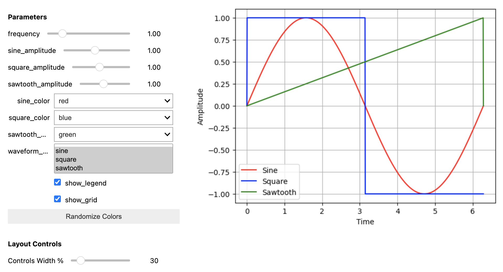

.. _tutorial:

Tutorial
========

Here's a complete example. You can view the complete example
`here <https://github.com/landoskape/syd/blob/main/docs/examples/example_notebook.ipynb>`_ 
or run it yourself in colab:

.. image:: https://colab.research.google.com/assets/colab-badge.svg
   :target: https://colab.research.google.com/github/landoskape/syd/blob/main/docs/examples/example_notebook.ipynb
   :alt: Open In Colab

This page is a work in progress! The notebook above contains more explanations, so head
there if you want more details. 

.. code-block:: python

    import numpy as np
    import matplotlib.pyplot as plt
    from syd import Viewer

    class SimpleWaveformViewer(Viewer):
        """A simple example viewer that shows an interactive waveform."""
        
        def __init__(self):            
            # Add parameters
            self.add_float("frequency", value=1.0, min=0.1, max=5.0)
            self.add_float("sine_amplitude", value=1.0, min=0.1, max=2.0)
            self.add_float("square_amplitude", value=1.0, min=0.1, max=2.0)
            self.add_float("sawtooth_amplitude", value=1.0, min=0.1, max=2.0)
            self.add_selection("sine_color", value="red", options=["red", "blue", "green"])
            self.add_selection("square_color", value="blue", options=["red", "blue", "green"])
            self.add_selection("sawtooth_color", value="green", options=["red", "blue", "green"])
            self.add_multiple_selection("waveform_type", value=["sine", "square", "sawtooth"], options=["sine", "square", "sawtooth"])
            self.add_boolean("show_legend", value=True)
            self.add_boolean("show_grid", value=True)

        def plot(self, state):
            """Plot the waveform based on current parameters."""
            t = np.linspace(0, 2*np.pi, 1000)

            ymin = float("inf")
            ymax = float("-inf")

            fig, ax = plt.subplots()
            if "sine" in state["waveform_type"]:    
                ax.plot(t, state["sine_amplitude"] * np.sin(state["frequency"] * t), color=state["sine_color"], label="Sine")
                ymin = min(ymin, -state["sine_amplitude"])
                ymax = max(ymax, state["sine_amplitude"])
            if "square" in state["waveform_type"]:
                ax.plot(t, state["square_amplitude"] * np.sign(np.sin(state["frequency"] * t)), color=state["square_color"], label="Square")
                ymin = min(ymin, -state["square_amplitude"])
                ymax = max(ymax, state["square_amplitude"])
            if "sawtooth" in state["waveform_type"]:
                ax.plot(t, state["sawtooth_amplitude"] * (t % (2*np.pi/state["frequency"])) * (state["frequency"] / 2 / np.pi), color=state["sawtooth_color"], label="Sawtooth")
                ymin = min(ymin, -state["sawtooth_amplitude"])
                ymax = max(ymax, state["sawtooth_amplitude"])

            ax.set_xlabel("Time")
            ax.set_ylabel("Amplitude")
            ax.grid(state["show_grid"])
            ax.set_ylim(ymin*1.1, ymax*1.1)
            if state["show_legend"]:
                ax.legend()
            return fig

    viewer = SimpleWaveformViewer()
    viewer.show()

